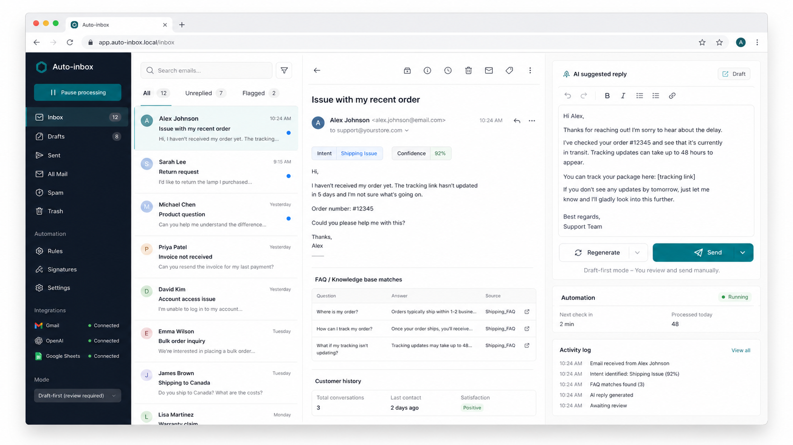

# Auto-inbox



Auto-inbox is an open-source AI inbox assistant for teams that want faster customer replies without giving up human review. It reads like a premium support dashboard: incoming emails, intent detection, FAQ context, a generated reply, activity logs, and a clear manual `Enviar` action before anything is sent.

[](https://react.dev/)
[](https://www.typescriptlang.org/)
[](https://vite.dev/)
[](LICENSE)

## Overview

Auto-inbox turns the workflow of an AI email responder into a product-ready interface. The current version is a polished frontend prototype built for portfolio and open-source iteration. It uses realistic demo data so anyone can explore the experience without connecting Gmail, Google Sheets, or OpenAI credentials, and it already includes a desktop-ready Gmail OAuth bridge layer for the next Tauri or Electron step.

The product direction is intentionally human-in-the-loop: AI prepares the response, but the user reviews and sends it manually.

## Highlights

- Premium 4-column inbox dashboard inspired by modern email and support tools.
- Dark sidebar with mailbox, automation, integration, and mode controls.
- Searchable inbox list with unread states and selected-message focus.
- Email detail view with customer metadata, intent, confidence, FAQ matches, and history.
- AI suggested reply composer with formatting controls, regenerate action, and manual `Enviar` button.
- Desktop-ready Gmail OAuth connection panel with sync state, history ID tracking, and least-privilege scopes.
- Automation status panel and activity log for observability.
- English and Spanish interface language toggle while keeping email content untouched.
- Responsive layout with no horizontal overflow on mobile.

## Tech Stack

- React 19
- TypeScript
- Vite
- lucide-react
- CSS modules-style global styling with responsive grid layouts

## Getting Started

```bash
npm install
npm run dev
```

Open the local URL printed by Vite.

## Desktop Development

Auto-inbox now includes an Electron shell for the future `.exe` build. In desktop mode, the React app receives a secure `window.autoInboxGmail` bridge from Electron instead of handling Google tokens directly.

```bash
npm run dev:desktop
```

For a Windows installer build:

```bash
npm run dist:desktop
```

## Build

```bash
npm run build
```

## Gmail OAuth Architecture

Auto-inbox is prepared for the safest desktop path: Google OAuth 2.0 for installed apps, Gmail API scopes, and secure token storage in the desktop shell.

- The React UI calls a `window.autoInboxGmail` bridge when Tauri or Electron exposes it.
- The Electron preload exposes that bridge through isolated IPC.
- The browser build falls back to a demo bridge so the open-source app remains easy to run.
- The first production scopes are `gmail.readonly` and `gmail.compose`, avoiding full mailbox access unless the product truly needs it.
- Initial sync can use `users.messages.list` and `users.messages.get`.
- Incremental sync can persist the latest `historyId` and call `users.history.list`.
- Sending should stay human-in-the-loop: generate a Gmail draft first, then let the user review and send.
- Access and refresh tokens are encrypted with Electron `safeStorage` and kept outside frontend storage.

To test real Gmail OAuth locally, create a Google Cloud OAuth client for a desktop app and set:

```bash
GOOGLE_OAUTH_CLIENT_ID=your-client-id
GOOGLE_OAUTH_CLIENT_SECRET=optional-client-secret
```

The app also reads a local `.env` file during desktop startup. The web-only Vite build still works without Gmail credentials.

## Product Roadmap

- Settings UI for Gmail OAuth client configuration.
- Google Sheets FAQ source and enquiry log.
- OpenAI-powered classification and reply generation.
- Real Gmail draft creation before sending.
- Safety rules for newsletters, billing, legal, and sensitive support cases.
- Desktop installer polish, app icon, and signed releases.
- Optional hosted SaaS mode for always-on automation.

## Project Structure

```text
Auto-Inbox/
  electron/                Electron shell, preload bridge, and Google OAuth flow
  docs/images/             README and GitHub assets
  src/gmail/               Gmail OAuth bridge, API helpers, and sync types
  src/main.tsx             Main React application
  src/styles.css           Premium dashboard styling
  .env.example             Future desktop OAuth configuration placeholders
  index.html               Vite entry
  package.json             Scripts and dependencies
  tsconfig.electron.json   Electron TypeScript build config
```

## Philosophy

Auto-inbox is not trying to hide automation behind a black box. It is designed around review, clarity, and trust: show the reasoning context, show the generated reply, and keep the final send action in the user's hands.

## License

MIT
